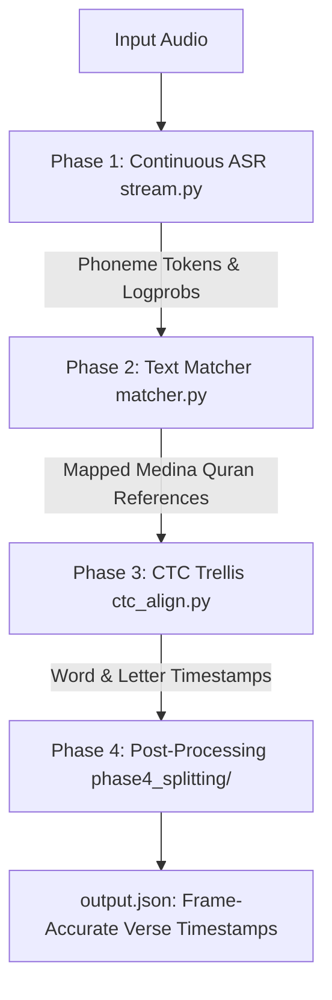

# QuranReciteToText Architecture & Pipeline Guide

## 1. Overview
`QuranReciteToText` is an offline, high-precision Quran recitation transcription and forced-alignment engine. It takes an audio recitation file and generates frame-accurate word-level and letter-level timestamps aligned to the standard Medina Mushaf (Hafs 'an 'Asim).

---

## 2. Directory Layout & Module Responsibilities

```
QuranReciteToText/
├── config.py                   # Global paths, flags, and feature toggles
├── run.py                      # CLI entry point (multiprocessing / thread tuning)
├── data/
│   ├── onnx/                   # Zipformer INT8 acoustic models & tokens.txt
│   ├── ordered_quran_phonemes.json # Canonical Medina Mushaf phoneme sequences
│   └── qpc_hafs.json           # Uthmani text reference
└── src/
    ├── core/                   # Core shared utilities, models, and orchestration
    │   ├── main_flow.py        # Central 4-phase pipeline coordinator (process_audio)
    │   ├── segment_types.py    # Canonical SegmentInfo dataclass & JSON export
    │   ├── sdk_adapt.py        # QUA SDK data converters
    │   ├── quran_index.py      # Medina Mushaf canonical word lookups
    │   └── updater.py          # Background GitHub release checker
    ├── phase1_transcribe/      # Acoustic feature extraction & inference
    │   ├── stream.py           # Continuous ASR stream & natural pause chunking
    │   └── zipformer.py        # ONNX Zipformer2 acoustic model inference
    ├── phase2_matching/        # Quran text alignment & verse resolution
    │   ├── matcher.py          # Sequence matching, repetition refinement, gap recovery
    │   └── normalize.py        # Phoneme tokenization & Tajweed substitution penalty engine
    ├── phase3_alignment/       # Precise timestamp forced alignment
    │   └── ctc_align.py        # Viterbi trellis forced alignment (word & letter timings)
    └── phase4_splitting/      # Post-alignment splitting & formatting
        ├── ayah_split.py       # Special opening & Ayah boundary splitting + word smoothing
        ├── auto_merge.py       # Same-Ayah continuous segment fusion
        └── missing_words.py    # Unrecited word detection & injection
```

---

## 3. Four-Phase Data Flow



### **Phase 1: Continuous ASR Transcription (`src/phase1_transcribe/`)**
* **Model**: Zipformer2 INT8 ONNX acoustic model (40ms encoder step, 25 fps).
* **Chunking**: Single continuous pass over raw 16kHz PCM buffer. Cuts utterances *only* at natural breath pauses ($\ge 2.0\text{s}$ pause + subsequent phoneme is a valid Arabic voweled consonant `_VALID_STARTERS`).

### **Phase 2: Post-ASR Text Matching (`src/phase2_matching/`)**
* Maps recognized Tajweed phonemes onto canonical Quranic verses (`Surah:Ayah:Word`).
* **Repetition Refinement**: Slices and re-transcribes reciter pause-repetitions (e.g. breath repeats) to ensure complex verses are unified into single continuous segments.
* **Gap Recovery**: Scans gaps $\ge 2.5\text{s}$ for whispered or quiet words.

### **Phase 3: CTC Forced Alignment (`src/phase3_alignment/`)**
* Runs dynamic programming Viterbi trellis over the Zipformer log-probability matrix $T \times 251$.
* Extracts frame-perfect start/end millisecond timestamps for every word and letter.
* Applies $-60\text{ms}$ streaming lookahead delay compensation and energy-weighted blank distribution.

### **Phase 4: Post-Processing & Splitting (`src/phase4_splitting/`)**
1. **`ayah_split.py`**:
   * Splits fused openings (*Isti'adha* + *Basmala*).
   * Splits multi-ayah audio chunks into $1\text{-to-}1$ Ayah cards using CTC word timestamps.
2. **`auto_merge.py`**:
   * Fuses continuous fragments of the same Ayah into a unified segment.
3. **`missing_words.py`**:
   * Cross-references recited word indices against the canonical Quran dictionary to mark/inject unrecited words.
4. **`smooth_word_timestamps()`**:
   * Extends word end timestamps into trailing acoustic silence for smooth karaoke rendering.

---

## 4. Key Data Contracts (`SegmentInfo`)

Every audio segment is represented by `SegmentInfo` in [segment_types.py](file:///d:/there%20is%20no%20god%20unless%20ALLAH/QuranReciteToText/src/core/segment_types.py):

```python
@dataclass
class SegmentInfo:
    start_time: float                     # Segment start in seconds
    end_time: float                       # Segment end in seconds
    transcribed_text: str                 # Recognized phoneme string
    matched_text: str                     # Canonical Medina Mushaf Arabic text
    matched_ref: str                      # "surah:ayah:from_word-surah:ayah:to_word"
    match_score: float                    # Match confidence [0.0, 1.0]
    words: list[dict] | None = None       # Word-level timing entries
    has_missing_words: bool = False       # True if unrecited words exist in range
    has_repeated_words: bool = False      # True if reciter repeated words
```

Each word in `seg.words`:
```json
{
  "word": "ٱلرَّحْمَـٰنِ",
  "location": "1:3:1",
  "start": 0.12,
  "end": 0.84,
  "phonemes": [
    {"char": "ررَ", "start": 0.12, "end": 0.32},
    {"char": "ح", "start": 0.32, "end": 0.52},
    {"char": "مَ", "start": 0.52, "end": 0.68},
    {"char": "اا", "start": 0.68, "end": 0.78},
    {"char": "نِ", "start": 0.78, "end": 0.84}
  ]
}
```
