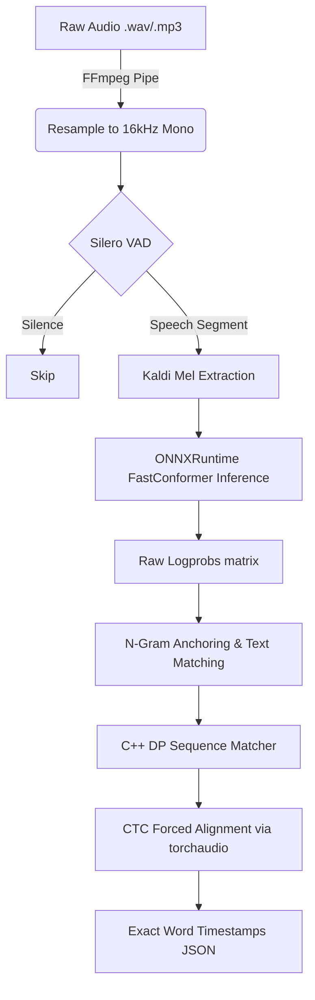

بفضل الله و برحمته 
الحمد لله رب العالمين

# Quran Recite to Text (Lightweight CPU Edition)

This project provides an automated, lightweight pipeline for transcribing and aligning Quranic recitations with the exact text of the Quran. It processes audio files of reciters, transcribes the Arabic phonetics/text, and precisely aligns the results against a canonical Quran index to provide highly accurate timestamps at the segment, word, and even letter level.


## Screenshot


## Fast Use
- **fast usage to test** : go to folder where run.py is and add a recitation "audio.mp3" then open cmd in folder ```
python run.py --audio audio.mp3``` 
The output will be saved as `output.json` in the same directory, featuring a production-ready schema perfectly matched to downstream applications like QuranCaption.
  
##  Projects Used

- **Original System**: This architecture is ported from [Hetchy's Quranic Universal Aligner](https://huggingface.co/spaces/hetchyy/quranic-universal-aligner). While Hetchy's version utilized heavy models on HuggingFace Space requiring GPUs and interactive UIs, this repository provides a highly optimized, pure CLI version that runs entirely on the CPU.
- **Acoustic Model**: The transcription is powered by the FastConformer model, utilizing the [Tilawa](https://github.com/yazinsai/tilawa) dataset/model trained by [@yazinsai](https://github.com/yazinsai). 
- **VAD Segmenter**: Silence and speech segmentation is handled by a lightweight Silero VAD running purely on CPU.

---

##  How It Works

The pipeline abandons legacy overlapping sliding window approaches in favor of dynamic Voice Activity Detection (VAD) segmentation, ensuring optimal performance on a CPU-bound environment:



1. **Audio Ingestion**: Audio files (`.wav`, `.mp3`, etc.) are rapidly loaded and resampled to a consistent 16kHz mono format via an `ffmpeg` pipe for efficiency without memory bloat.
2. **Dynamic VAD Segmentation**: The audio is processed sequentially using **Silero VAD** to detect genuine speech segments and accurately skip over non-speech silences.
3. **CPU Acoustic Transcription**: Speech segments undergo exact Kaldi Mel feature extraction and are passed to a native **ONNXRuntime** FastConformer session, yielding a raw sequence of token probabilities (`logprobs`).
4. **Quranic Text Matching**: The ASR text output is anchored and mathematically aligned to the true QPC Hafs script using a blazing-fast C++ Dynamic Programming engine (`qua_sdk`).
5. **CTC Forced Alignment**: The exact, authenticated Uthmani words are mapped back onto the acoustic probability matrix via `torchaudio`'s Viterbi forced alignment, yielding mathematically optimal, frame-perfect start and end times for every single word without drifting or overlaps.

---

## 💻 Run Pipeline

### Prerequisites

- **Python**
- **FFmpeg**: Must be installed and accessible in your system PATH.

### Usage

Use the provided `run.py` script to transcribe an audio file from the command line. This will process the audio offline on your CPU and output a highly detailed JSON file.

```bash
python run.py --audio <path-to-audio-file> --out <path-to-output-json>
```

### Examples

To process a sample audio file named `recitation.mp3`:

```bash
python run.py --audio recitation.mp3
```

---

## 📄 JSON Output Structure

The output is saved as a JSON array perfectly mirroring the schema of the original QUA engine, including comprehensive repetition tracking.

```json
[
  {
    "segment_number": 1,
    "start_time": 0.0,
    "end_time": 12.5,
    "transcribed_text": "...",
    "matched_text": "بِسْمِ اللَّهِ الرَّحْمَٰنِ الرَّحِيمِ",
    "matched_ref": "1:1:1-1:1:4",
    "match_score": 0.98,
    "has_missing_words": false,
    "has_repeated_words": false,
    "words": [
      {
        "word": "بِسْمِ",
        "start": 0.5,
        "end": 1.2,
        "location": "1:1:1"
      }
    ]
  }
]
```

### Key Fields:
- `start_time` / `end_time`: The absolute boundaries of the spoken segment in the audio.
- `matched_text`: The exact, orthographically correct Quranic text matched from the canonical index.
- `matched_ref`: The Quranic reference span (e.g., `Surah:Ayah:Word-Surah:Ayah:Word`).
- `match_score`: Confidence score of the match.
- `has_missing_words` / `has_repeated_words`: Flags indicating recitation anomalies (useful for grading).
- `wrap_word_ranges`, `repeated_ranges`, `repeated_text`: Arrays that mathematically track when a reciter loops back and repeats verses (Wraparound DP tracking).
- `words`: Detailed array of every word spoken, containing absolute `start`/`end` times, and its exact `location` index in the Quran (e.g., `1:1:1` for Surah 1, Ayah 1, Word 1).

---

## 🎯 What It Can Be Used For

The JSON output unlocks several powerful applications:

1. **Interactive UI Highlighting**: Build web or mobile apps that highlight words exactly as the reciter speaks them.
2. **Automated Video Subtitling**: Generate perfectly synchronized Arabic and translated subtitles for YouTube videos or social media clips.
3. **Recitation Evaluation & Grading**: Use the `match_score`, `has_missing_words`, and `has_repeated_words` indicators to automatically assess the accuracy of a student's memorization (Hifz).
4. **Smart Audio Search**: Jump to a specific Ayah or Surah inside a massive audio file instantly using the absolute timestamps.
5. **Dataset Generation**: Automatically clip long hours of Taraweeh or Murattal audio into cleanly segmented, labeled Ayah-by-Ayah datasets for training other AI models. (using a larger model is better for this)

---

## Insha'a Allah : 
- [x] speedup matching   الحمد لله رب العالمين
- [x] integrate in QuranCaption application
- [x] Improve Accuracy 
- [x] Improve Json output (1:1 schema parity with original QUA)
